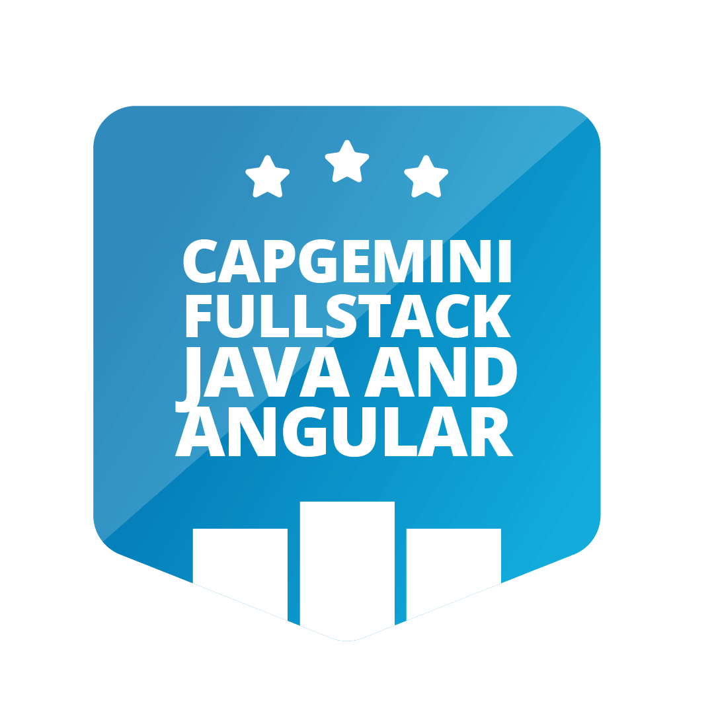

<h1 align="center">Netflix Clone</h1>

<p align="center">

</p>

## About

Netflix Clone is a simple responsive clone of Netflix.

This Project was developed for Capgemini Fullstack Java and Angular Bootcamp in Digital Innovation One.

## Technologies

- HTML5
- CSS3
- Owl Carousel

## Run Project

Clone Project

```git
git clone https://github.com/thiagotrs/netflix-clone.git
```

## Author

Thiago Rotondo Sampaio - [GitHub](https://github.com/thiagotrs) / [Linkedin](https://www.linkedin.com/in/thiago-rotondo-sampaio) / [Email](mailto:thiagorot@gmail.com)

## License

This project use MIT license, see the file [LICENSE](./LICENSE.md) for more details

---

<p align="center">Develop by <a href="https://github.com/thiagotrs">Thiago Rotondo Sampaio</a></p>